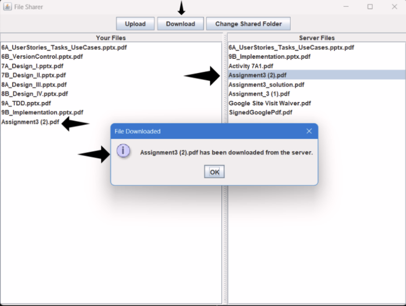

# File Sharing System

## Project Information
The File Sharing System is a simple client-server application designed to allow users to share text files between their local machine and a central server. This system allows users to upload, download, and view files in a shared directory on the server. The client features a graphical user interface (GUI) with two lists: one for local files and one for server files. Users can interact with the system effectively through user-friendly commands. This system is particularly useful for environments where multiple users need to access and exchange documents seamlessly.

## Key Features
- **DIR Command**: Lists the contents of the shared folder on the server.
- **UPLOAD Command**: Allows the client to upload a text file to the server.
- **DOWNLOAD Command**: Enables the client to download a text file from the server.
- **Multi-threaded Server**: Each client connection is handled by a separate thread (`ClientConnectionHandler`), ensuring simultaneous connections are supported.
- **Graphical User Interface (GUI)**: Provides an easy-to-use interface for managing files.

## Improvements  
Several enhancements were made to improve the functionality and aesthetics of the system:

- **Graphical Shared Folder Configuration**: Added a "Configure Shared Folder" button to allow users to set the shared folder path graphically instead of relying solely on command-line arguments.  
- **Error Handling**: Improved error messages to provide clear feedback to users in case of issues such as missing files or invalid paths.  
- **UI Refresh**: After every upload or download operation, both the local and server file lists are refreshed automatically to reflect the latest state.  
- **Code Organization**: Modularized the code into separate classes (`Client`, `Server`, `FolderConfigPanel`) for better readability and maintainability.  
- **UI Adjustments**: Added UI adjustments to clearly differentiate between user and server files. 
- **Success Pop-Up**: Added an additional pop-up that shows successful upload/download of files after completing the operation.  


## How to Run
### Prerequisites
- Java Development Kit (JDK) 11 or higher installed on your machine.
- A text editor or IDE (e.g., IntelliJ IDEA, VS Code) for viewing and editing the code.

### Steps to Run the Application
#### 1. Clone the Repository
Clone the repository using:

```bash
git clone <repository-url>
cd <repository-directory>
```

#### 2. Compile the Code
Navigate to the project directory and compile the source files:

```bash
javac src/main/java/assignment02/Server.java
javac src/main/java/assignment02/Client.java
javac src/main/java/assignment02/FolderConfigPanel.java
```

#### 3. Start the Server
The server must be running before starting the client. Follow these steps:
1. Open a terminal window and navigate to the project directory.
2. Start the server by specifying the path to the shared folder.
3. Run the server with the path to the shared folder as an argument:

```bash
java -cp src/main/java assignment02.Server <path_to_shared_folder>
```

Example:

```bash
java -cp src/main/java assignment02.Server /Users/username/shared
```
4. Once the server starts successfully, you should see the following output in the terminal:
```bash
Server started on port 1234
```

#### 4. Start the Client
Run the client with the server's hostname and the local folder path as arguments:

```bash
java -cp src/main/java assignment02.Client <server_host> <local_folder_path>
```

Example:

```bash
java -cp src/main/java assignment02.Client localhost /Users/username/local
```
##### -> A graphical user interface (GUI) will appear with two lists:
- **Left List**: Displays files in the local shared folder.
- **Right List**: Displays files in the server's shared folder.

### 4. Interact with the Application
Use the GUI to upload and download files between the local and server directories:

#### **Upload a File**
1. Select a file from the left list (local files).
2. Click the **Upload** button.
3. The file will be copied to the server's shared folder, and the right list will refresh automatically.

#### **Download a File**
1. Select a file from the right list (server files).
2. Click the **Download** button.
3. The file will be copied to the local shared folder, and the left list will refresh automatically.

#### **Configure Shared Folder**
1. Click the **Configure Shared Folder** button.
2. Use the file chooser dialog to select a new shared folder path.
3. Both the local and server file lists will refresh to reflect the changes.

## Screenshot of Application (Demo)
### Upload file


### Download File

### Change Shared Folder


## Explanation of the Code
### Server (`Server.java`)
The server listens for incoming client connections on port `1234`. Each client connection is handled by a separate thread (`ClientConnectionHandler`). The server supports three commands:

- `DIR`: Lists the contents of the shared folder on the server.
- `UPLOAD filename`: Saves the uploaded file from the client to the shared folder.
- `DOWNLOAD filename`: Sends the requested file from the shared folder to the client.

The server ensures that each connection is closed immediately after handling the command, making it lightweight and efficient.

### Client (`Client.java`)
The client provides a graphical user interface (GUI) built using Java Swing. It consists of two lists:

- **Local Files**: Displays files in the local shared folder.
- **Server Files**: Displays files in the server's shared folder.

The client communicates with the server using sockets. It sends commands (`DIR`, `UPLOAD`, `DOWNLOAD`) and handles file transfers accordingly. The GUI refreshes both lists automatically after every upload or download operation.

### Folder Configuration Panel (`FolderConfigPanel.java`)
This panel allows users to configure the shared folder path graphically. It uses a `JFileChooser` to select the folder and updates the local file list dynamically.

## Error Handling
Both the client and server include durable error handling to ensure smooth operation. Errors such as missing files, invalid paths, or network issues are displayed to the user with clear messages.

## Other Resources
### Libraries Used
- **Java Swing**: For building the graphical user interface (GUI).
- **Java NIO**: For file and directory operations.
- **Java Sockets**: For client-server communication.

